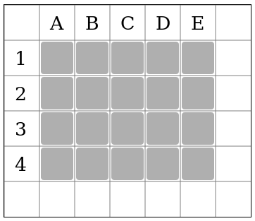
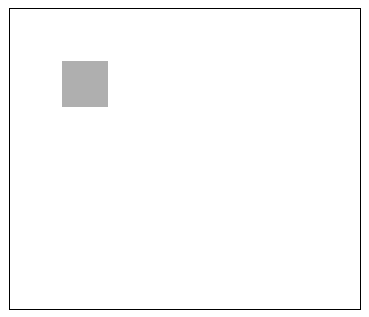
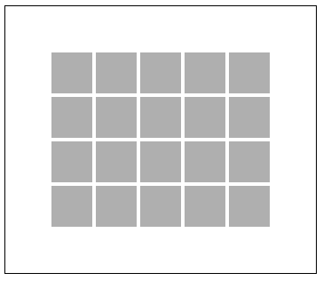
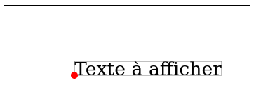
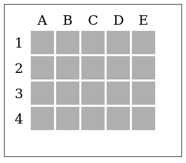

# Correction de la partie JavaScript (1/2)

## I. Structure de départ

Le contenu HTML est défini dans un fichier `demineur.html`. La zone de jeu est un `Canvas`:

```html
<!DOCTYPE html>
<html lang="fr">
<head>
  <meta charset="utf-8">
  <title>Jeu du démineur</title>
  <link rel="stylesheet" href="style.css">
</head>
<body onload="dessiner();">

  <canvas width="350" height="300" id="moncanvas">
    Canvas non supportée par votre navigateur
  </canvas>

  <script src="jeu.js"></script>
</body>
</html>
```

> Quelques précisions:
> 
> - l'éditeur utilisé code les caractères en `utf-8`.
> 
> - une feuille de style externe est chargée dans l'en-tête (fichier `style.css`, même répertoire que le fichier HTML).
> 
> - un script externe est chargé (fichier `jeu.js`, même répertoire que le fichier HTML) et une fonction `dessiner()` est appelée une fois la page chargée (attribut `onload` de la balise ouvrante `body`).

Pour vérifier le bon chargement de la feuille de style et visualiser les limites de la zone de jeu, on ajoute ces instructions *CSS* dans le fichier `style.css` :

- centrage horizontal du *Canvas*,

- bordure noire d'un point autour du *Canvas*.

```css
#moncanvas {
  border: 1pt solid black;
  display: block;
  margin: auto;
  margin-top: 100px;
}
```

Pour vérifier le bon chargement du script, on ajoute temporairement l'instruction suivante dans le fichier `jeu.js`:

```javascript
function dessiner() {
  alert("JavaScript chargé!");
}
```

Le rendu est le suivant:


> Supprimer l'instruction `alert(...)` pour la suite.

## II. Dessiner le plateau

Le *Canvas* a une définition de 350x300 px, ce qui correspond à 5+2 colonnes et 4+2 lignes de 50 px:



### 1. Cases de jeu

Nous avons besoin de 3 nuances de gris selon l'état de la case :

```javascript
function dessiner() {
  // Couleurs utiles
  const GRIS_MOYEN = "rgb(175,175,175)"; // cellule non-jouée
  const GRIS_CLAIR = "rgb(225,225,225)"; // cellule jouée (et vide)
  const GRIS_FONCE = "rgb(100,100,100)"; // cellule jouée (et mine)

  // Récupérer le pinceau
  let canvas = document.querySelector("#moncanvas");
  let pinceau = canvas.getContext("2d");
}
```

Dans cette correction, une case sera un simple rectangle 46x46 px (afin de laisser de l'espace entre les cases):

```javascript
  // Dessiner les cases
  pinceau.fillStyle = GRIS_MOYEN;
  pinceau.fillRect(52,52,46,46);
```



Plutôt que de faire 19 copier-coller pour dessiner les autres cellules, nous plaçons cette instruction dans 2 boucles *for* imbriquées (une pour les lignes et une pour les colonnes):

```javascript
// Dessiner les cases
pinceau.fillStyle = GRIS_MOYEN;
for (let i=1; i<=4; i+=1) { // Boucle sur les lignes (=ordonnées)
  for (let j=1; j<=5; j+=1) { // Boucle sur les colonnes (=abscisses)
    pinceau.fillRect(2+50*j,2+50*i,46,46);
  }
}
```

Ce qui donne le résultat suivant:



### 2. Légendes

Les légendes sont écrites sur la première ligne et la première colonne du plateau.

Pour dessiner du texte en *JavaScript*, il faut utiliser `pinceau.fillText("Texte à affichier", x, y)`:

```javascript
pinceau.font = '20pt comicsans';
pinceau.fillStyle = 'black';
pinceau.fillText("Texte à afficher", 100, 100); // texte,x,y
```

> `x ` et `y` sont les coordonnées du coin inférieur gauche du rectangle qui contient `Texte à afficher`:
> 

Là encore, pour éviter de copier-coller plusieurs fois la ligne de dessin de texte, on peut utiliser une boucle:

```javascript
  // Légendes
  pinceau.font = '20pt comicsans';
  pinceau.fillStyle = 'black';

  const legendeH = " ABCDE"; // Texte horizontal
  for (let j=1; j<=5; j+=1) {
    pinceau.fillText(legendeH[j], 50*j+15, 40);  
  }

  const legendeV = " 1234"; // Texte verticale
  for (let i=1; i<=4; i+=1) {
    pinceau.fillText(legendeV[i], 20, 50*i+35);  
  }
```

> `legendeV[i]` permet de récupérer uniquement le *i-ème* caractère de la chaîne `legendeV` (idem pour `legendeH[j]`).

Les coordonnées *x* et *y* ont été ajustées manuellement pour *à peu près* centrer le texte dans chaque ligne et colonne, ce qui donne le résultat suivant:



## III. Gestion de la souris

### 1. Notion d'événement

> La programmation événementielle est souvent utilisée lors du développement d'interfaces graphiques. Pour faire simple:
> 
> - le programme principal dessine le contenu de l'affichage et passe ensuite la majeur partie de son temps à attendre (sans rien faire).
> 
> - à chaque action de l'utilisateur (souris, clavier...) sont déclenchés un (ou plusieurs) événement(s). 
> 
> - Le programme ignore ces événements (par défaut) mais on peut aussi lui demander de réagir à un événement particulier en déclenchant l'exécution d'une fonction.

Un clic de souris déclenche 2 **événement**s :

- `mousedown` : au moment où l'utilisateur appuie sur un bouton.

- `mouseup`: au moment où l'utilisateur relâche le bouton.

> Note: il existe d'autres événements de souris que nous n'aborderons pas ici.

Nous choisissons (arbitrairement) de traiter l'événement `mousedown`. 

Pour *demander* d'être averti à chaque fois qu'un événement `mousedown` survient sur le *Canvas*, il faut ajouter l'instruction suivante:

```javascript
  // Capturer l'événement mousedown
  canvas.addEventListener('mousedown', gestionClick);
```

Grace à cette instruction, l'événement `mousedown` va déclencher l'appel d'une fonction `gestionClick` que nous allons créer à la fin du fichier `jeu.js`.

Les coordonnées du clic de la souris dans le *Canvas* sont accessibles respectivement dans `event.offsetX` et `event.offsetY`:

```javascript
function gestionClick(event) {
  let x = event.offsetX;
  let y = event.offsetY;

  // Affichage dans la console
  console.log(x + ", " + y);
}
```

> Attention de ne pas oublier le paramètre `event` de cette fonction.

Recharger la page et vérifier que les coordonnées s'affichent dans la console à chaque clic de la souris dans le *Canvas*.

### 2. Identification de la case cliquée

Chaque case du plateau fait 50 x 50 px. Il suffit donc de diviser `x `et `y` par 50 (et ne conserver que la partie entière) pour connaître respectivement les indices de colonne et ligne où l'utilisateur a cliqué.

Ajouter ces instructions à la place de `console.log(x + ...)`:

```javascript
let colonne = Math.floor(x/50);
let ligne = Math.floor(y/50);

// Debug
console.log(ligne + ', '+ colonne);
```

On exclue ensuite la première et dernière ligne (idem pour les colonnes) car elles ne correspondent pas à des cases valides:

```javascript
if (colonne<=0 || colonne>=6 || ligne<=0 || ligne>=5) {
  return; // Fin de la fonction de traitement
}

// Debug
console.log(ligne + ', '+ colonne);
```

Nous terminons cette première partie en retournant une chaîne `coup` qui contient l'identifiant de la cas (au format du type `"A2"`,  `"E4"`):

```javascript
const legendeH = " ABCDE";
const legendeV = " 1234";
let coup = legendeH[colonne] + legendeV[ligne];
console.log(coup)
```
