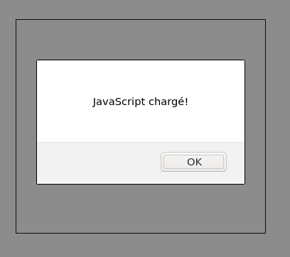

# Correction de la partie JavaScript

## I. Structure de départ

Le contenu HTML est défini dans un fichier `demineur.html`. La zone de jeu est un `Canvas`:

```html
<!DOCTYPE html>
<html lang="fr">
<head>
  <meta charset="utf-8">
  <title>Jeu du démineur</title>
  <link rel="stylesheet" href="style.css">
</head>
<body onload="dessiner();">

  <canvas width="350" height="300" id="moncanvas">
    Canvas non supportée par votre navigateur
  </canvas>

  <script src="jeu.js"></script>
</body>
</html>
```

> Quelques précisions:
> 
> - l'éditeur utilisé code les caractères en `utf-8`.
> 
> - une feuille de style externe est chargée dans l'en-tête (fichier `style.css`, même répertoire que le fichier HTML).
> 
> - un script externe est chargé (fichier `jeu.js`, même répertoire que le fichier HTML) et une fonction `dessiner()` est appelée une fois la page chargée (attribut `onload` de la balise ouvrante `body`).

Pour vérifier le bon chargement de la feuille de style et visualiser les limites de la zone de jeu, on ajoute ces instructions *CSS* dans le fichier `style.css` :

- centrage horizontal du *Canvas*,

- bordure noire d'un point autour du *Canvas*.

```css
#moncanvas {
  border: 1pt solid black;
  display: block;
  margin: auto;
  margin-top: 100px;
}
```

Pour vérifier le bon chargement du script, on ajoute temporairement l'instruction suivante dans le fichier `jeu.js`:

```javascript
function dessiner() {
  alert("JavaScript chargé!");
}
```

Le rendu est le suivant:



> Supprimer l'instruction `alert(...)` pour la suite.

## II. Dessiner le plateau

Le *Canvas* a une définition de 350x300 px, ce qui correspond à 5+2 colonnes et 4+2 lignes de 50 px:

<svg width="350" height="300" style="border: 1px solid black;">
    <text x="65" y="40" style="font: 30px serif;">A</text>
    <text x="115" y="40" style="font: 30px serif;">B</text>
    <text x="165" y="40" style="font: 30px serif;">C</text>
    <text x="215" y="40" style="font: 30px serif;">D</text>
    <text x="265" y="40" style="font: 30px serif;">E</text>
    <text x="25" y="85" style="font: 30px serif;">1</text>
    <rect x="52" y="52" width="46" height="46" fill="rgb(175,175,175)" />
    <rect x="102" y="52" width="46" height="46" fill="rgb(175,175,175)" />
    <rect x="152" y="52" width="46" height="46" fill="rgb(175,175,175)" />
    <rect x="202" y="52" width="46" height="46" fill="rgb(175,175,175)" />
    <rect x="252" y="52" width="46" height="46" fill="rgb(175,175,175)" />
    <text x="25" y="135" style="font: 30px serif;">2</text>
    <rect x="52" y="102" width="46" height="46" fill="rgb(175,175,175)" />
    <rect x="102" y="102" width="46" height="46" fill="rgb(175,175,175)" />
    <rect x="152" y="102" width="46" height="46" fill="rgb(175,175,175)" />
    <rect x="202" y="102" width="46" height="46" fill="rgb(175,175,175)" />
    <rect x="252" y="102" width="46" height="46" fill="rgb(175,175,175)" />
    <text x="25" y="185" style="font: 30px serif;">3</text>
    <rect x="52" y="152" width="46" height="46" fill="rgb(175,175,175)" />
    <rect x="102" y="152" width="46" height="46" fill="rgb(175,175,175)" />
    <rect x="152" y="152" width="46" height="46" fill="rgb(175,175,175)" />
    <rect x="202" y="152" width="46" height="46" fill="rgb(175,175,175)" />
    <rect x="252" y="152" width="46" height="46" fill="rgb(175,175,175)" />
    <text x="25" y="235" style="font: 30px serif;">4</text>
    <rect x="52" y="202" width="46" height="46" fill="rgb(175,175,175)" />
    <rect x="102" y="202" width="46" height="46" fill="rgb(175,175,175)" />
    <rect x="152" y="202" width="46" height="46" fill="rgb(175,175,175)" />
    <rect x="202" y="202" width="46" height="46" fill="rgb(175,175,175)" />
    <rect x="252" y="202" width="46" height="46" fill="rgb(175,175,175)" />
    <path stroke="lightgray" stroke-width="1"
          d="M 50 0 v 300 m 50 0 v -300 m 50 0 v 300 m 50 0 v -300 m 50 0 v 300 m 50 0 v -300 m 50 50 h -350 m 0 50 h 350 m 0 50 h -350 m 0 50 h 350 m 0 50 h -350"/>
</svg>


### 1. Cases de jeu

Nous avons besoin de 3 nuances de gris selon l'état de la case :

```javascript
function dessiner() {
  // Couleurs utiles
  const GRIS_MOYEN = "rgb(175,175,175)"; // cellule non-jouée
  const GRIS_CLAIR = "rgb(225,225,225)"; // cellule jouée (et vide)
  const GRIS_FONCE = "rgb(100,100,100)"; // cellule jouée (et mine)

  // Récupérer le pinceau
  let canvas = document.querySelector("#moncanvas");
  let pinceau = canvas.getContext("2d");
}
```

Dans cette correction, une case sera un simple rectangle 46x46 px (afin de laisser de l'espace entre les cases):

```javascript
  // Dessiner les cases
  pinceau.fillStyle = GRIS_MOYEN;
  pinceau.fillRect(52,52,46,46);
```

<svg width="350" height="300" style="border: 1px solid black;">
    <rect x="52" y="52" width="46" height="46" fill="rgb(175,175,175)" />
</svg>

Plutôt que de faire 19 copier-coller pour dessiner les autres cellules, nous plaçons cette instruction dans 2 boucles *for* imbriquées (une pour les lignes et une pour les colonnes):

```javascript
// Dessiner les cases
pinceau.fillStyle = GRIS_MOYEN;
for (let i=1; i<=4; i+=1) { // Boucle sur les lignes (=ordonnées)
  for (let j=1; j<=5; j+=1) { // Boucle sur les colonnes (=abscisses)
    pinceau.fillRect(2+50*j,2+50*i,46,46);
  }
}
```

Ce qui donne le résultat suivant:

<svg width="350" height="300" style="border: 1px solid black;">
    <rect x="52" y="52" width="46" height="46" fill="rgb(175,175,175)" />
    <rect x="102" y="52" width="46" height="46" fill="rgb(175,175,175)" />
    <rect x="152" y="52" width="46" height="46" fill="rgb(175,175,175)" />
    <rect x="202" y="52" width="46" height="46" fill="rgb(175,175,175)" />
    <rect x="252" y="52" width="46" height="46" fill="rgb(175,175,175)" />
    <rect x="52" y="102" width="46" height="46" fill="rgb(175,175,175)" />
    <rect x="102" y="102" width="46" height="46" fill="rgb(175,175,175)" />
    <rect x="152" y="102" width="46" height="46" fill="rgb(175,175,175)" />
    <rect x="202" y="102" width="46" height="46" fill="rgb(175,175,175)" />
    <rect x="252" y="102" width="46" height="46" fill="rgb(175,175,175)" />
    <rect x="52" y="152" width="46" height="46" fill="rgb(175,175,175)" />
    <rect x="102" y="152" width="46" height="46" fill="rgb(175,175,175)" />
    <rect x="152" y="152" width="46" height="46" fill="rgb(175,175,175)" />
    <rect x="202" y="152" width="46" height="46" fill="rgb(175,175,175)" />
    <rect x="252" y="152" width="46" height="46" fill="rgb(175,175,175)" />
    <rect x="52" y="202" width="46" height="46" fill="rgb(175,175,175)" />
    <rect x="102" y="202" width="46" height="46" fill="rgb(175,175,175)" />
    <rect x="152" y="202" width="46" height="46" fill="rgb(175,175,175)" />
    <rect x="202" y="202" width="46" height="46" fill="rgb(175,175,175)" />
    <rect x="252" y="202" width="46" height="46" fill="rgb(175,175,175)" />
</svg>


### 2. Légendes

Les légendes sont écrites sur la première ligne et la première colonne du plateau.

Pour dessiner du texte en *JavaScript*, il faut utiliser `pinceau.fillText("Texte à affichier", x, y)`:

```javascript
pinceau.font = '20pt comicsans';
pinceau.fillStyle = 'black';
pinceau.fillText("Texte à afficher", 100, 100); // texte,x,y
```

> `x ` et `y` sont les coordonnées du coin inférieur gauche du rectangle qui contient `Texte à afficher`:
> 
><svg width="350" height="300" style="border: 1px solid black;">
>  <text x="100" y="100" style="font: 20px sans-serif;">Texte à afficher</text>
>  <circle cx="100" cy="100" r="2.5" fill="red"/>
>  <rect x="100" y="85" width="135" height="15" stroke="black" fill="None"/>
></svg>


Là encore, pour éviter de copier-coller plusieurs fois la ligne de dessin de texte, on peut utiliser une boucle:

```javascript
  // Légendes
  pinceau.font = '20pt comicsans';
  pinceau.fillStyle = 'black';

  const legendeH = " ABCDE"; // Texte horizontal
  for (let j=1; j<=5; j+=1) {
    pinceau.fillText(legendeH[j], 50*j+15, 40);  
  }

  const legendeV = " 1234"; // Texte verticale
  for (let i=1; i<=4; i+=1) {
    pinceau.fillText(legendeV[i], 20, 50*i+35);  
  }
```

> `legendeV[i]` permet de récupérer uniquement le *i-ème* caractère de la chaîne `legendeV` (idem pour `legendeH[j]`).

Les coordonnées *x* et *y* ont été ajustées manuellement pour *à peu près* centrer le texte dans chaque ligne et colonne, ce qui donne le résultat suivant:

<svg width="350" height="300" style="border: 1px solid black;">
    <text x="65" y="40" style="font: 30px serif;">A</text>
    <text x="115" y="40" style="font: 30px serif;">B</text>
    <text x="165" y="40" style="font: 30px serif;">C</text>
    <text x="215" y="40" style="font: 30px serif;">D</text>
    <text x="265" y="40" style="font: 30px serif;">E</text>
    <text x="25" y="85" style="font: 30px serif;">1</text>
    <rect x="52" y="52" width="46" height="46" fill="rgb(175,175,175)" />
    <rect x="102" y="52" width="46" height="46" fill="rgb(175,175,175)" />
    <rect x="152" y="52" width="46" height="46" fill="rgb(175,175,175)" />
    <rect x="202" y="52" width="46" height="46" fill="rgb(175,175,175)" />
    <rect x="252" y="52" width="46" height="46" fill="rgb(175,175,175)" />
    <text x="25" y="135" style="font: 30px serif;">2</text>
    <rect x="52" y="102" width="46" height="46" fill="rgb(175,175,175)" />
    <rect x="102" y="102" width="46" height="46" fill="rgb(175,175,175)" />
    <rect x="152" y="102" width="46" height="46" fill="rgb(175,175,175)" />
    <rect x="202" y="102" width="46" height="46" fill="rgb(175,175,175)" />
    <rect x="252" y="102" width="46" height="46" fill="rgb(175,175,175)" />
    <text x="25" y="185" style="font: 30px serif;">3</text>
    <rect x="52" y="152" width="46" height="46" fill="rgb(175,175,175)" />
    <rect x="102" y="152" width="46" height="46" fill="rgb(175,175,175)" />
    <rect x="152" y="152" width="46" height="46" fill="rgb(175,175,175)" />
    <rect x="202" y="152" width="46" height="46" fill="rgb(175,175,175)" />
    <rect x="252" y="152" width="46" height="46" fill="rgb(175,175,175)" />
    <text x="25" y="235" style="font: 30px serif;">4</text>
    <rect x="52" y="202" width="46" height="46" fill="rgb(175,175,175)" />
    <rect x="102" y="202" width="46" height="46" fill="rgb(175,175,175)" />
    <rect x="152" y="202" width="46" height="46" fill="rgb(175,175,175)" />
    <rect x="202" y="202" width="46" height="46" fill="rgb(175,175,175)" />
    <rect x="252" y="202" width="46" height="46" fill="rgb(175,175,175)" />
</svg>
## III. Gestion de la souris

### 1. Notion d'événement

> La programmation événementielle est souvent utilisée lors du développement d'interfaces graphiques. Pour faire simple:
> 
> - le programme principal dessine le contenu de l'affichage et passe ensuite la majeur partie de son temps à attendre (sans rien faire).
> 
> - à chaque action de l'utilisateur (souris, clavier...) sont déclenchés un (ou plusieurs) événement(s). 
> 
> - Le programme ignore ces événements (par défaut) mais on peut aussi lui demander de réagir à un événement particulier en déclenchant l'exécution d'une fonction.

Un clic de souris déclenche 2 **événement**s :

- `mousedown` : au moment où l'utilisateur appuie sur un bouton.

- `mouseup`: au moment où l'utilisateur relâche le bouton.

> Note: il existe d'autres événements de souris que nous n'aborderons pas ici.

Nous choisissons (arbitrairement) de traiter l'événement `mousedown`. 

Pour *demander* d'être averti à chaque fois qu'un événement `mousedown` survient sur le *Canvas*, il faut ajouter l'instruction suivante:

```javascript
  // Capturer l'événement mousedown
  canvas.addEventListener('mousedown', gestionClick);
```

Grace à cette instruction, l'événement `mousedown` va déclencher l'appel d'une fonction `gestionClick` que nous allons créer à la fin du fichier `jeu.js`.

Les coordonnées du clic de la souris dans le *Canvas* sont accessibles respectivement dans `event.offsetX` et `event.offsetY`:

```javascript
function gestionClick(event) {
  let x = event.offsetX;
  let y = event.offsetY;

  // Affichage dans la console
  console.log(x + ", " + y);
}
```

> Attention de ne pas oublier le paramètre `event` de cette fonction.

Recharger la page et vérifier que les coordonnées s'affichent dans la console à chaque clic de la souris dans le *Canvas*.

### 2. Identification de la case cliquée

Chaque case du plateau fait 50 x 50 px. Il suffit donc de diviser `x `et `y` par 50 (et ne conserver que la partie entière) pour connaître respectivement les indices de colonne et ligne où l'utilisateur a cliqué.

Ajouter ces instructions à la place de `console.log(x + ...)`:

```javascript
let colonne = Math.floor(x/50);
let ligne = Math.floor(y/50);

// Debug
console.log(ligne + ', '+ colonne);
```

On exclue ensuite la première et dernière ligne (idem pour les colonnes) car elles ne correspondent pas à des cases valides:

```javascript
if (colonne<=0 || colonne>=6 || ligne<=0 || ligne>=5) {
  return; // Fin de la fonction de traitement
}

// Debug
console.log(ligne + ', '+ colonne);
```

Nous terminons cette première partie en retournant une chaîne `coup` qui contient l'identifiant de la cas (au format du type `"A2"`,  `"E4"`):

```javascript
const legendeH = " ABCDE";
const legendeV = " 1234";
let coup = legendeH[colonne] + legendeV[ligne];
console.log(coup)
```

## IV. Interface avec demineur.js

> Pour utiliser ce script:
>
> - l'enregistrer dans le répertoire courant (qui contient déjà `demineur.html`, `jeu.js`...)
>
> - ajouter cet élément HTML dans le fichier `demineur.html` (juste avant la balise de chargement de `jeu.js`):
>
>   ```html
>   <script src="demineur.js"></script>
>   ```

### 1. Décoration des cases

Le contenu des cases est stocké dans la *table d'affichage*  obtenue après l'appel de `initDemineur` (en dehors de toute fonction) :

```javascript
// Initialisation du jeu
let init = init = initDemineur(5,4,3); // nbCol, nbLignes, nbMines
var voisinage = init[0]; 
var affichage = init[1];
```

> Rappel: les cases sont parcourues à l'aide d'une double boucle `for` (`i`: indice de ligne, `j`: indice de colonne).

Il y a 3 couleurs de case possibles :

1. *gris foncé*, si la case est jouée et contient une mine (`affichage[i][j]` est égale à -1)

<svg width="50" height="50">
  <rect width="46" height="46" x="2" y="2" fill="rgb(100,100,100)" />
</svg>

2. *gris clair*, si elle est jouée et ne contient pas de mine (`affichage[i][j]` est entre 0 et 8)

<svg width="50" height="50">
  <rect width="46" height="46" x="2" y="2" fill="rgb(225,225,225)" />
</svg>

3. *gris moyen*, si elle est non jouée (`affichage[i][j]` est supérieur à 10)

<svg width="50" height="50">
  <rect width="46" height="46" x="2" y="2" fill="rgb(175,175,175)" />
</svg>
> Le choix de la couleur s'effectue donc à l'aide des instructions :
>
> ```javascript
> // Couleur de la case courante
> if (affichage[i][j]==-1) {
>   pinceau.fillStyle = GRIS_FONCE; 
> } else if(affichage[i][j]>=0 && affichage[i][j]<=8) {
>     pinceau.fillStyle = GRIS_CLAIR;
> } else if(affichage[i][j]>=10) {
>     pinceau.fillStyle = GRIS_MOYEN; 
> }
> ```

La case peut aussi comporter des décorations :

- case jouée avec mine(s) voisine(s) : affichage du nombre de mine

<svg width="50" height="50">
  <rect width="46" height="46" x="2" y="2" fill="rgb(225,225,225)" />
  <text x="18" y="32" style="font: 20px sans-serif;">5</text>
</svg>
```javascript
// Décoration avec le nombre de mines
pinceau.font = "15pt comicsans";
pinceau.fillText("5", 18,32); // Chiffre à adapter
```


- case jouée avec mine découverte: dessiner la mine

<svg width="50" height="50">
  <rect width="46" height="46" x="2" y="2" fill="rgb(100,100,100)" />
  <circle cx="25" cy="25" r="10" />
  <path stroke="black" stroke-width="3" d="M 12 12 l 26 26 m -26 0 
l 26 -26 m -13 -4 v 34" />
</svg>


```javascript
// Motif d'une mine (Path2D)
let mine = new Path2D();
mine.arc(25,25,10,0,Math.PI*2); // cercle de rayon 10 centré en (25,25)
mine.moveTo(12,12); mine.lineTo(38,38); // diagonale 1
mine.moveTo(12,38); mine.lineTo(38,12); // diagonale 2
mine.moveTo(25,8); mine.lineTo(25,42); // trait vertical
```

- case non jouée mais marquée comme :
  
  - contenant sûrement une mine: dessiner un drapeau
  
  <svg width="50" height="50">
    <rect width="46" height="46" x="2" y="2" fill="rgb(175,175,175)" />
    <path fill="black" stroke="black" stroke-width="3"
      stroke-width="3" d="M 8 42 v -34 l 17 8 l -17 8 Z" />
  </svg>
  
  
  ```javascript
  // Motif d'un drapeau (Path2D)
  let drapeau = new Path2D();
  drapeau.moveTo(8,42); drapeau.lineTo(8,8); // trait vertical
  drapeau.lineTo(25,16); drapeau.lineTo(8,24); // triangle
  ```
  
  
  - contenant peut-être une mine: dessiner un drapeau et un `? `. 
  
  <svg width="50" height="50">
    <rect width="46" height="46" x="2" y="2" fill="rgb(175,175,175)" />
    <path fill="black" stroke="black" stroke-width="3"
      stroke-width="3" d="M 8 42 v -34 l 17 8 l -17 8 Z" />
    <text x="25" y="42" style="font: 15px sans-serif;">?</text>
  </svg>
  
  ```javascript
  pinceau.font = "15pt comicsans";
  pinceau.fillText("?", 25,42);
  ```

Les coordonnées des motifs ci-dessus sont spécifiées entre les points (0,0) et (50,50), c'est à dire la cellule en haut à gauche du *Canvas*. Pour placer le motif dans la bonne case, on va utiliser la technique suivante:

1. sauvegarder la configuration du pinceau,
2. translater le repère à l'endroit de la bonne cellule,
3. Effectuer les opérations de dessin: changer la couleur, la police, dessiner le remplissage et/ou le contour du motif...
4. restaurer la configuration initiale du pinceau.

Les instructions *JavaScript* correspondantes :

```javascript
///// Décoration de la cellule /////
// Étape 1
pinceau.save();
// Étape 2
pinceau.translate(j*50, i*50); // case ligne i colonne j
// Étape 3 
pinceau.fillStyle = "black";
pinceau.lineWidth = 3;
pinceau.font = "15pt comicsans";
if (affichage[i][j]==-1) { // Présence d'une mine
    pinceau.stroke(mine); // contour de la mine
    pinceau.fill(mine); // remplissage de la mine    
} else if (affichage[i][j]>0 && affichage[i][j]<=8) { // Mine(s) voisine(s)
    pinceau.fillText(affichage[i][j], 18,32);
} else if(affichage[i][j]>=11) {
    pinceau.stroke(drapeau); // contour du drapeau
    pinceau.fill(drapeau); // remplissage du drapeau
    if (affichage[i][j]==12) {
        pinceau.fillText("?", 25,42);
    }
}

// Étape 4
pinceau.restore();
```

Pour tester les divers affichages de cases, on peut ajouter temporairement les lignes suivantes (après l'appel à la fonction `initDemineur`):

```javascript
// Pour tester
affichage[1][1] = 0;
affichage[1][2] = 1;
affichage[1][3] = 11;
affichage[1][4] = 12;
affichage[1][5] = -1;
```

<svg width="350" height="300" style="border: 1px solid black;">
    <text x="65" y="40" style="font: 30px serif;">A</text>
    <text x="115" y="40" style="font: 30px serif;">B</text>
    <text x="165" y="40" style="font: 30px serif;">C</text>
    <text x="215" y="40" style="font: 30px serif;">D</text>
    <text x="265" y="40" style="font: 30px serif;">E</text>
    <text x="25" y="85" style="font: 30px serif;">1</text>
    <rect x="52" y="52" width="46" height="46" fill="rgb(225,225,225)" />
    <rect x="102" y="52" width="46" height="46" fill="rgb(225,225,225)" />
    <text x="118" y="82" style="font: 20px sans-serif;">1</text>
    <rect x="152" y="52" width="46" height="46" fill="rgb(175,175,175)" />
    <path fill="black" stroke="black" stroke-width="3"
    stroke-width="3" d="M 158 92 v -34 l 17 8 l -17 8 Z" />
    <rect x="202" y="52" width="46" height="46" fill="rgb(175,175,175)" />
    <path fill="black" stroke="black" stroke-width="3"
    stroke-width="3" d="M 208 92 v -34 l 17 8 l -17 8 Z" />
    <text x="225" y="92" style="font: 15px sans-serif;">?</text>
    <rect x="252" y="52" width="46" height="46" fill="rgb(100,100,100)" />
    <circle cx="275" cy="75" r="10" />
  	<path stroke="black" stroke-width="3" d="M 262 62 l 26 26 m -26 0 
l 26 -26 m -13 -4 v 34" />
    <text x="25" y="135" style="font: 30px serif;">2</text>
    <rect x="52" y="102" width="46" height="46" fill="rgb(175,175,175)" />
    <rect x="102" y="102" width="46" height="46" fill="rgb(175,175,175)" />
    <rect x="152" y="102" width="46" height="46" fill="rgb(175,175,175)" />
    <rect x="202" y="102" width="46" height="46" fill="rgb(175,175,175)" />
    <rect x="252" y="102" width="46" height="46" fill="rgb(175,175,175)" />
    <text x="25" y="185" style="font: 30px serif;">3</text>
    <rect x="52" y="152" width="46" height="46" fill="rgb(175,175,175)" />
    <rect x="102" y="152" width="46" height="46" fill="rgb(175,175,175)" />
    <rect x="152" y="152" width="46" height="46" fill="rgb(175,175,175)" />
    <rect x="202" y="152" width="46" height="46" fill="rgb(175,175,175)" />
    <rect x="252" y="152" width="46" height="46" fill="rgb(175,175,175)" />
    <text x="25" y="235" style="font: 30px serif;">4</text>
    <rect x="52" y="202" width="46" height="46" fill="rgb(175,175,175)" />
    <rect x="102" y="202" width="46" height="46" fill="rgb(175,175,175)" />
    <rect x="152" y="202" width="46" height="46" fill="rgb(175,175,175)" />
    <rect x="202" y="202" width="46" height="46" fill="rgb(175,175,175)" />
    <rect x="252" y="202" width="46" height="46" fill="rgb(175,175,175)" />
</svg>

> Supprimer ces instructions, une fois l'affichage validé

### 2. Gestion des attaques

> Rappel: actuellement, lorsque le joueur clique avec sa souris, la fonction `gestionClick` identifie et affiche le nom de la case dans la console du navigateur.

Nous allons compléter cette gestion en:

1. identifiant le bouton de la souris qui a été cliqué (clic gauche pour *creuser* et clic droit pour basculer entre *non-joué/drapeau/incertain*)
2. appelant la fonction `gestionCoup` (du script `demineur.js`) pour que la table d'affichage soit mise à jour.
3. ré-appelant la fonction  `dessiner` pour mettre à jour l'affichage du plateau.

L'événement souris `event` contient le numéro du bouton cliqué dans `event.button`. Nous allons utiliser cette information pour générer le paramètre `commande` pour appeler la fonction `gestionCoup`:

- si `event.button` vaut 0 &rarr; clic gauche. On veut creuser (`commande=1`)
- si `event.button` vaut 1 &rarr; clic milieu. On ne veut rien faire.
- si `event.button` vaut 2 &rarr; clic droit. On veut basculer entre les 3 annotations (`commande=3`).

> Pour ne pas qu'apparaisse le menu contextuel lorsqu'on clic droit sur le *Canvas*, il faut désactiver l'événement correspondant à l'aide de l'instruction:
>
> ```javascript
> canvas.addEventListener('contextmenu', canvas.fn2 = e=> { e.preventDefault(); });
> ```

Les instructions à ajouter dans `gestionClick` sont donc les suivantes:

```javascript
// Identificaion du bouton de souris
if (event.button==1) { // clic milieu
  return;
}
commande = event.button+1;

// Prise en compte du coup
gestionCoup(coup, commande, affichage, voisinage);

// Mise à jour de l'affichage
dessiner();
```

### 3. Fin de la partie

Quelques améliorations du code :

- **JavaScript**: créer une fonction `init_jeu()` avec les instructions d'initialisation 

```javascript
// Variables globales
var pinceau, affichage, voisinage, canvas;

function init_jeu() {
  // Initialisation du jeu
  let init = initDemineur(5,4,3);
  affichage = init[1];
  voisinage = init[0];

  // Récupérer le pinceau
  canvas = document.querySelector("#moncanvas");
  pinceau = canvas.getContext("2d");
  // Capturer l'événement mousedown
  canvas.addEventListener('mousedown', gestionClick);
  // Supprimer le menu contextuel
  canvas.addEventListener('contextmenu', canvas.fn1 = e=> { e.preventDefault(); });
    
  // Actualiser l'affichage
  dessiner();
}
```

- **HTML**: modifier la fonction *JavaScript* appelée à la fin du chargement de la page et ajouter un élément pour afficher le résultat de la partie

  ```html
  <body onload="init_jeu();">
  	...
      <div id="resultat"> </div>
      ...
  </body>
  ```


Lorsque la partie s'achève, il faut:

- désactiver la gestion des événements souris.
- afficher l'emplacement des mines.
- afficher le résultat dans la partie sur la page HTML.

```javascript
function fin(res) {
   // Réinitialisation la gestions des événements.
   canvas.removeEventListener('mousedown', gestionClick);
   canvas.removeEventListener('contextmenu', canvas.fn1);
   
   // Afficher les mines
   for (let i=1; i<=4; i+=1) { // Boucle sur les lignes
     for (let j=1; j<=5; j+=1) { // Boucle sur les colonnes
       if (voisinage[i][j]==9) { // Présence d'une mine
           affichage[i][j] = -1; // L'afficher
       }
     }
   }
    
   let resultat = document.querySelector("#resultat");
    if (res) {
        resultat.innerHTML = "Gagné !";
    } else {
        resultat.innerHTML = "Perdu !";
    }
}
```


La partie se termine dans une des 2 situations suivantes:

1. *Victoire*: le joueur a creusé à l'endroit d'une mine.
2. *Défaite* : le joueur a identifié toutes les mines et découvert les cellules vides.

La première situation est détectée grâce à la valeur de retour de la fonction `gestionCoup`. Pour la deuxième situation, il faut appeler la fonction `partieGagnee` (de `demineur.js`):

```javascript
// Prise en compte du coup
let mine = gestionCoup(coup, commande, affichage, voisinage);

// Situation 1
if (mine) {
    fin(false);
}

// Situation 2
if (partieGagnee(affichage, voisinage)) {
    fin(true);
}
```

## V. Pistes d'amélioration

- Adapter le code pour d'autres valeurs des nombres de lignes, colonnes et de mines (ex: 10 mines dans un plateau 8x8 dessiné dans un canvas de 450x450 pixels)
- Dessiner des cases rectangulaires aux bords arrondis.
- Chronométrer la partie.
- ...